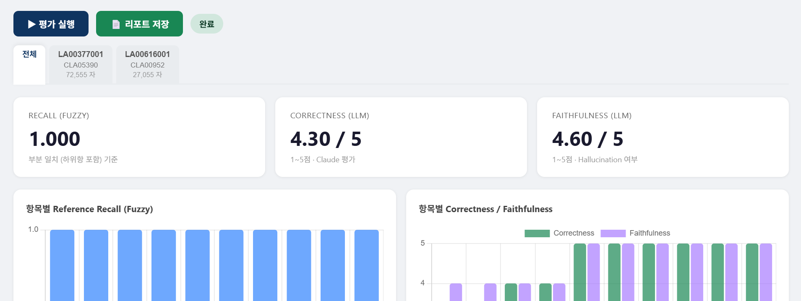
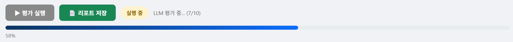
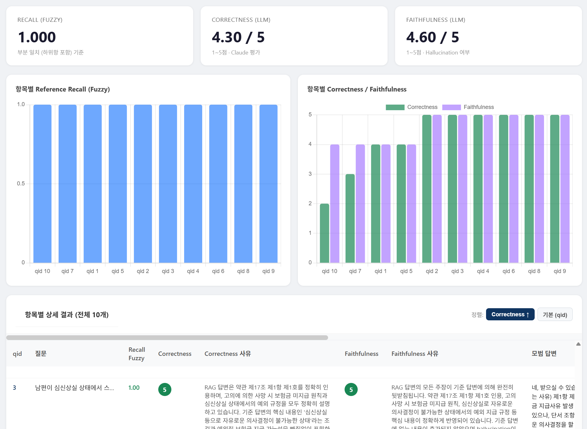
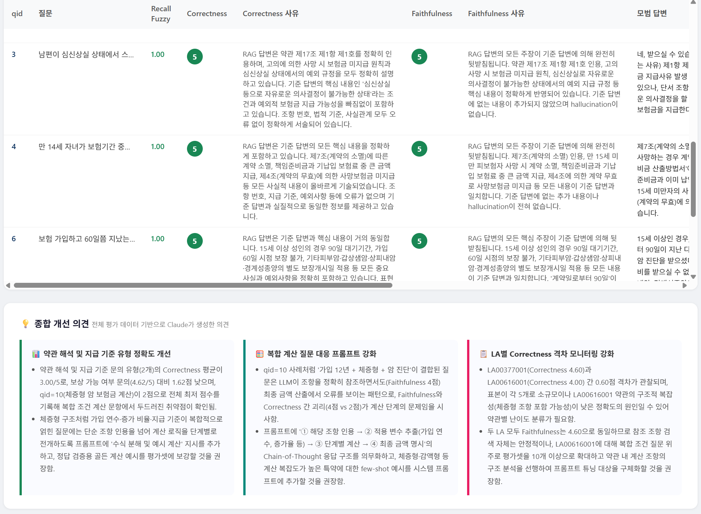

# 📄 RAG Evaluation Dashboard



보험 약관 QA 데이터셋을 기반으로 RAG 시스템 성능을 평가하는 웹 대시보드입니다.  
Claude API(LLM-as-a-judge)를 활용하여 **Reference Recall**, **Answer Correctness**, **Faithfulness** 를 자동 평가하고 개선 의견을 생성합니다.

## 주요 기능

- **Reference Recall** – RAG가 반환한 참조 조항과 정답 조항의 일치율 (fuzzy matching)
- **Answer Correctness** – LLM이 1~5점으로 평가하는 답변 정확도
- **Faithfulness** – 답변의 hallucination 여부를 LLM이 평가
- **AI 개선 의견** – 평가 결과 기반 Claude 자동 분석 카드
- **HTML 리포트 내보내기** – 서버 없이 열 수 있는 standalone 리포트 생성

## 디렉토리 구조

```
terms-rag-test/
├── src/
│   ├── server.py                       # FastAPI 웹 서버 (메인)
│   ├── criterion.py                    # 평가 지표 함수 (Recall / Correctness / Faithfulness)
│   └── export_html.py                  # HTML 리포트 내보내기
├── data/
│   └── input/
│       └── all_policies_rag_answer.jsonl   # 입력 데이터
├── .env                                # API 키 설정 (직접 생성 필요)
├── .env.example                        # .env 템플릿
└── requirements.txt
```

> **생성 파일** (`data/output/` — 자동 생성)  
> `all_policies_eval_result.jsonl` · `all_policies_advice.json` · `rag_eval_report_*.html`

## 시작하기

### 1. 요구사항

- Python 3.10 이상
- Anthropic API 키

### 2. 설치

```bash
git clone https://github.com/esthyj/terms-rag-test.git
cd terms-rag-test

pip install -r requirements.txt
```

### 3. 환경 변수 설정

```bash
cp .env.example .env
```

`.env` 파일을 열어 API 키를 입력합니다.

```
ANTHROPIC_API_KEY=sk-ant-...
```

### 4. 데이터 준비

입력 파일 `data/input/all_policies_rag_answer.jsonl`은 질문·정답·메타데이터가 미리 채워진 상태로 제공됩니다.  
**사용자가 직접 채워야 하는 열은 `rag_answer`와 `rag_reference` 두 가지뿐입니다.**

| 필드 | 타입 | 작성 주체 | 설명 |
|------|------|-----------|------|
| `qid` | int | 제공 | 질문 고유 ID |
| `question` | str | 제공 | 질문 텍스트 |
| `answer` | str | 제공 | 정답(ground truth) 답변 |
| `reference` | list[str] | 제공 | 정답 참조 조항 (예: `["제17조"]`) |
| `type` | str | 제공 | 질문 유형 (예: `보상 가능 여부 문의`) |
| `la` | str | 제공 | 상품 코드 (예: `LA00377001`) |
| `cla` | str | 제공 | 약관 코드 (예: `CLA05390`) |
| `rag_answer` | str | **사용자 입력** | RAG 시스템이 생성한 답변 |
| `rag_reference` | list[str] | **사용자 입력 (선택)** | RAG 시스템이 반환한 참조 조항 — 제공 시 Recall 지표 활성화 |

> `rag_answer` 열이 없으면 서버 시작 시 빈 문자열로 자동 추가됩니다.  
> `rag_reference`는 선택 사항입니다. 없어도 Correctness · Faithfulness 평가는 정상 동작합니다.

예시:
```jsonl
{"qid": 1, "question": "...", "answer": "...", "reference": ["제15조"], "type": "보상 가능 여부 문의", "la": "LA00377001", "cla": "CLA05390", "rag_answer": "...", "rag_reference": ["제15조"]}
```

### 5. 서버 실행

```bash
python src/server.py
```

브라우저에서 [http://localhost:8000](http://localhost:8000) 에 접속합니다.

### 6. 평가 실행

1. 대시보드 상단의 **평가 실행** 버튼을 클릭합니다.

   

2. 진행 상황이 실시간으로 표시됩니다.
3. 완료 후 결과와 종합 개선 의견이 화면에 표시됩니다.

    
4. 각 담보별로 확인하고 싶다면, 위쪽 탭에서 각 담보별 결과를 구체적으로 확인하세요. 
5. **HTML 내보내기** 버튼으로 standalone 리포트 파일을 생성할 수 있습니다.

## 평가 지표 설명

### Reference Recall (Fuzzy)
- `rag_reference` 열이 있을 때만 계산됩니다.
- 정답 조항(`reference`)이 RAG 반환 조항(`rag_reference`)에 포함되었는지 부분 일치로 판단합니다.
- 예: 정답이 `제17조`이고 RAG가 `제17조 제2항`을 반환하면 일치로 처리합니다.

### Answer Correctness
- Claude API가 정답 답변과 RAG 답변을 비교하여 1~5점으로 채점합니다.

### Faithfulness
- RAG 답변이 약관에 기반해 있는지를 평가합니다. 
- 점수가 낮을수록 hallucination이 많음을 의미합니다.

